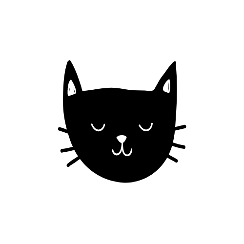

# Cat App Documentation

Welcome to the official documentation for the Cat App! 🐾

 <!-- Adjust the path based on your project structure -->

## Introduction

The Cat App is a delightful desktop application that brings joy to your screen with random cat images. This documentation provides information on how to use, develop, and contribute to the Cat App.

## Features

- 🐱 Display random cat images on your desktop.
- 🔄 Manual refresh button for new cat cuteness.
- 🖥 Compact window size for a seamless desktop experience.

## Table of Contents

- [Cat App Documentation](#cat-app-documentation)
  - [Introduction](#introduction)
  - [Features](#features)
  - [Table of Contents](#table-of-contents)
  - [Getting Started](#getting-started)
    - [Prerequisites](#prerequisites)
    - [Installation](#installation)

## Getting Started

### Prerequisites

Before you begin, make sure you have the following installed:

- [Node.js](https://nodejs.org/)
- npm (comes with Node.js)

### Installation

1. Clone the repository:

   ```sh
   git clone https://github.com/sebasop320/cat-app.git
  ```